# Cartesian admittance controller flowchart

当前实现中，名义 TCP 轨迹位于 world/base frame；F/T wrench、虚拟 `M/D/K` 和柔顺状态在实时测量的 actual TCP frame 中计算。柔顺输出随后转换回 world frame，并交给 libfranka 的 Cartesian motion generator。内层 joint impedance 使用 libfranka 生成的 `q_d`。

```mermaid
flowchart TD
    A([程序启动]) --> B[解析 CLI 参数]
    B --> C[加载 cartesian_admittance.yaml]
    C --> D[应用 soft/hard profile 和 CLI override]
    D --> E{配置是否合法?}
    E -- 否 --> E1[打印 configuration error] --> STOP([结束])
    E -- 是 --> F[初始化 wrench source<br/>serial / ROS topic / Franka]
    F --> G[连接 Franka<br/>automaticErrorRecovery]
    G --> H{payload.enabled?}
    H -- 是 --> H1[robot.setLoad]
    H -- 否 --> I[加载 robot model]
    H1 --> I
    I --> J[设置 collision behavior<br/>建立 Sensor/Flange/TCP 固定变换]
    J --> K[启动 libfranka combined control<br/>约 1 kHz]

    subgraph RT[每个实时控制周期]
        direction TB

        K --> S1[读取 RobotState]
        S1 --> S2[实际 Flange pose O_T_F]
        S2 --> S3[实际 TCP pose<br/>O_T_TCP = O_T_F · F_T_TCP]

        S3 --> T1{target_provider 存在?}
        T1 -- 是 --> T2[读取当前轨迹目标<br/>p_des, R_des in world]
        T1 -- 否 --> T3[minimum-jerk 固定目标<br/>p_des, R_des in world]

        S1 --> W1[读取 F/T wrench]
        W1 --> W2[应用 wrench.sign]
        W2 --> W3{外部 Sensor 且<br/>wrench.frame = local?}
        W3 -- 是 --> W4[Sensor 安装角补偿<br/>Sensor axes → world axes]
        W4 --> W5[力矩参考点移动<br/>Sensor origin → TCP tip]
        W3 -- 否 --> W6[得到 world@TCP wrench]
        W5 --> W6
        W6 --> W7[world axes → 实测 actual TCP axes<br/>W_TCP = diag R_a^T,R_a^T · W_world@TCP]
        W7 --> W8[前 500 个有效样本估计 bias]
        W8 --> W9[扣除 6D bias<br/>Force 和 Torque]
        W9 --> W10[admittance mask]
        W10 --> W11[Force/Torque deadband]
        W11 --> W12[Force/Torque saturation]
        W12 --> W13[一阶 low-pass filter]

        S3 --> X1[把保存的 world 柔顺状态<br/>投影到 actual TCP axes]
        W13 --> X2[actual-TCP-frame admittance]
        X1 --> X2
        X2 --> X3["M x_ddot + D x_dot + K x = W_ext"]
        X3 --> X4[加速度 actual TCP → world]
        X4 --> X5[积分 velocity / pose offset]
        X5 --> X6[速度、平移和旋转限幅]
        X6 --> X7[重新投影到 actual TCP<br/>清零 masked DOF]

        T2 --> P1[组合名义轨迹与柔顺输出]
        T3 --> P1
        X7 --> P1
        P1 --> P2["p_cmd = p_des + R_a x_TCP"]
        P2 --> P3["R_cmd = Exp(R_a phi_TCP) R_des"]
        P3 --> P4[TCP command → Flange command]
        P4 --> P5[返回 franka::CartesianPose]

        P5 --> IK[libfranka Cartesian motion generator<br/>内部 IK / 轨迹处理产生 q_d]
        S1 --> JC1[Joint impedance callback]
        IK --> JC1
        JC1 --> JC2["tau = Kq(q_d-q) - Dq·dq + coriolis"]
        JC2 --> JC3[Torque-rate limit]
        JC3 --> ROBOT[发送 joint torque command]

        W7 -. raw .-> LOG[Terminal / ring buffer / CSV logging]
        W9 -. bias_removed .-> LOG
        W13 -. filtered .-> LOG
        S3 -. pose error .-> LOG

        ROBOT --> Q{停止条件?}
        Q -- 否 --> S1
    end

    Q -- 是 --> L1[franka::MotionFinished]
    L1 --> L2[停止打印和 ROS/Serial threads]
    L2 --> L3[输出 settled summary<br/>按配置写 CSV/plot]
    L3 --> STOP
```

## Frame summary

| Quantity | Frame / reference point |
|---|---|
| Sensor 原始 wrench | Sensor axes @ Sensor origin |
| `raw`, `bias_removed`, `masked`, `filtered` terminal wrench | actual TCP axes @ TCP tip |
| `M`, `D`, `K`, admittance mask | actual TCP axes |
| 名义目标 `p_des`, `R_des` | world/base frame |
| 柔顺输出 `x_TCP`, `phi_TCP` | actual TCP axes |
| Cartesian command | world/base frame，随后转换为 Flange command |
| Joint impedance reference `q_d` | libfranka Cartesian motion generator / internal IK 输出 |
